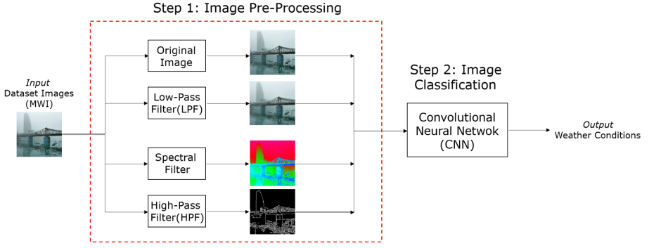

# Multi-classWeatherClassification

The present work focuses on the solution of a Machine Learning (ML) multi-class image classification problem. In particular, a 4-class weather classification problem has been tackled using Convolutional Neural Networks (CNN). More precisely, we refer to weather classification from images as the task of predicting if the weather is Haze, Rainy, Snowy or Sunny. This image classification problem has been addressed in two different ways: firstly, a CNN has been defined and trained from scratch and, secondly, transfer learning and fine tuning from a pretrained model have been applied.

